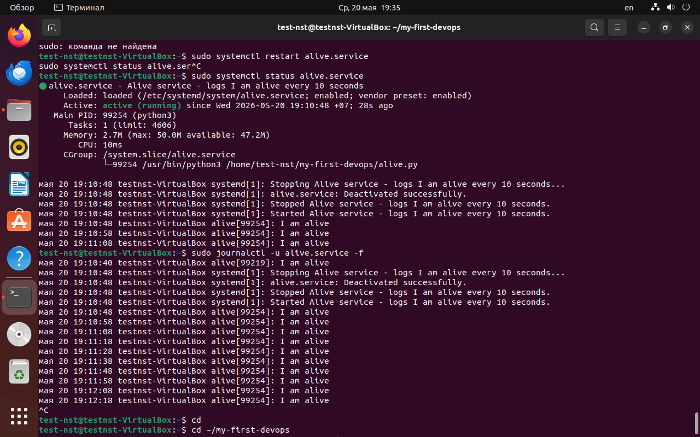
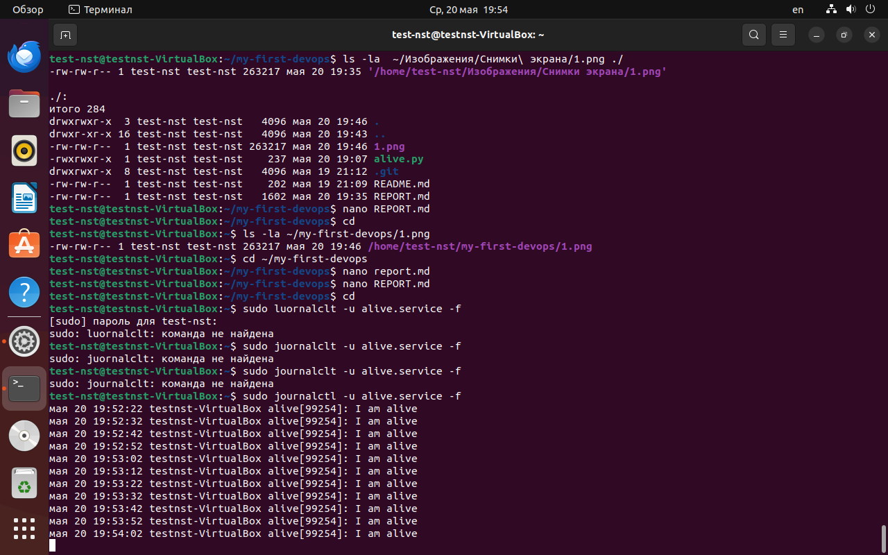
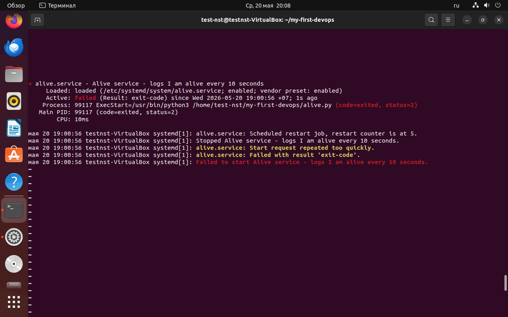

# Отчёт по заданию 1: Systemd-сервис
# 1. Содержимое юнит-файла

Файл `/etc/systemd/system/alive.service`:

   ini
[Unit]
Description=Alive service - logs I am alive every 10 seconds ----(Описание сервиса в systemctl status)
After=network.target ----(Запускается после поднятия сети)

[Service]
User=nobody ----(Запуск от непривилегированного пользователя)
Group=nogroup ----(Группа с минимальными правами)
ExecStart=/usr/bin/python3 /home/test-nst/my-first-devops/alive.py ----(Полный путь к интерпретатору Python и скрипту)
Restart=on-failure ----(Автоматически перезапускать сервис при ошибке)
MemoryMax=50M ----(Сервис не может использовать более 50 МБ ОЗУ)
CPUQuota=20% ----(Сервис не может загружать процессор более чем на 20%)
StandardOutput=journal ----(Весь вывод скрипта отправляется в systemd journal)
StandardError=journal ----(Ошибки также отправляются в journal)

[Install]
WantedBy=multi-user.target ----(Сервис стартует при загрузке системы)

#Управление сервисом
1. Запуск сервиса
sudo systemctl start alive.service
2. Остановка сервиса
sudo systemctl stop alive.service
3. Статус
sudo systemctl status alive.servic

#Просмотр логов
sudo journalctl -u alive.service -f

#Решение проблем
В процессе настройки возникла ошибка status=2 при запуске сервиса. Причина — конфликт shebang (#!/usr/bin/python3)
в скрипте с systemd. Решение: убрать первую строку в alive.py.

#Вывод
Systemd-сервис успешно создан и работает с заданными ограничениями. Скрипт каждые 10 секунд пишет в syslog сообщение "I am alive".
Сервис настроен на автозапуск и автоматический перезапуск при падении.
