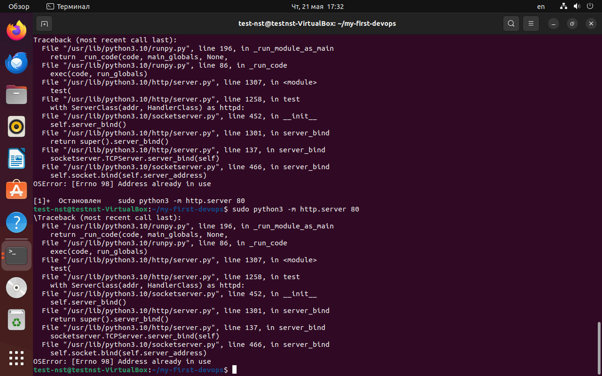
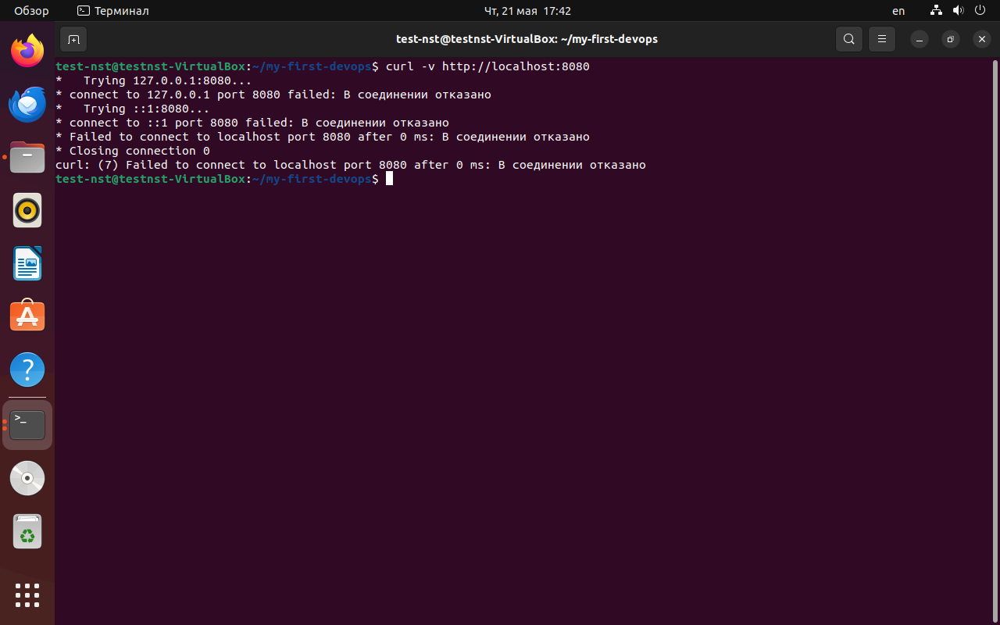
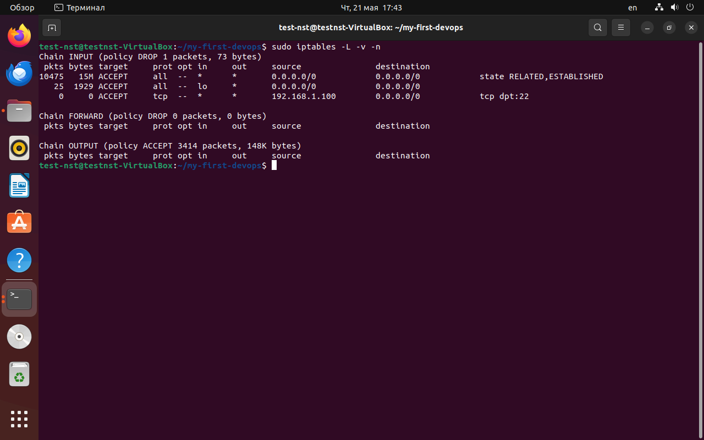
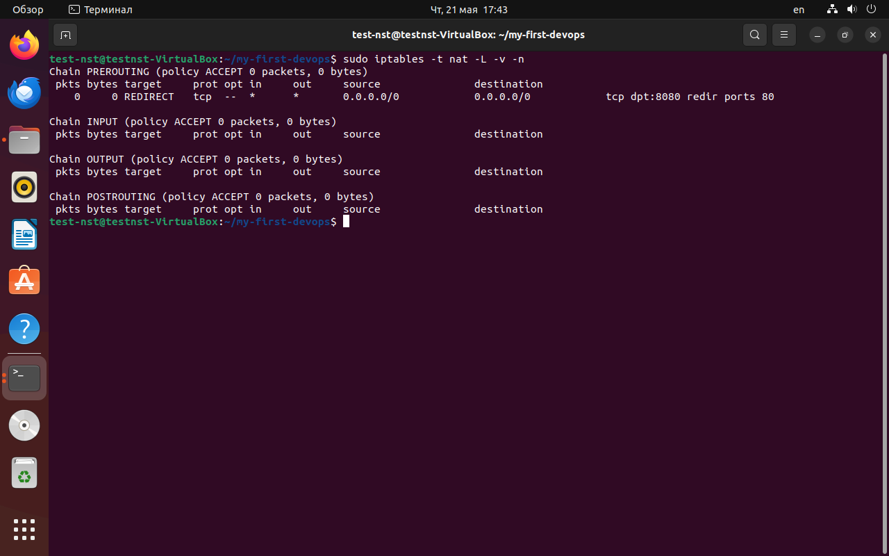

# Отчёт по заданию 1: Systemd-сервис
## 1. Содержимое юнит-файла

Файл `/etc/systemd/system/alive.service`:

   ini
[Unit]

Description=Alive service - logs I am alive every 10 seconds ----(Описание сервиса в systemctl status)
After=network.target ----(Запускается после поднятия сети)

[Service]

User=nobody ----(Запуск от непривилегированного пользователя)
Group=nogroup ----(Группа с минимальными правами)
ExecStart=/usr/bin/python3 /home/test-nst/my-first-devops/alive.py ----(Полный путь к интерпретатору Python и скрипту)
Restart=on-failure ----(Автоматически перезапускать сервис при ошибке)
MemoryMax=50M ----(Сервис не может использовать более 50 МБ ОЗУ)
CPUQuota=20% ----(Сервис не может загружать процессор более чем на 20%)
StandardOutput=journal ----(Весь вывод скрипта отправляется в systemd journal)
StandardError=journal ----(Ошибки также отправляются в journal)

[Install]

WantedBy=multi-user.target ----(Сервис стартует при загрузке системы)

#Управление сервисом
1. Запуск сервиса:
sudo systemctl start alive.service
2. Остановка сервиса:
sudo systemctl stop alive.service
3. Статус:
sudo systemctl status alive.servic
Вывод команды 

#Просмотр логов

sudo journalctl -u alive.service -f
Вывод команды

#Решение проблем
В процессе настройки возникла ошибка status=2 при запуске сервиса. Причина — конфликт shebang (#!/usr/bin/python3)
в скрипте с systemd. Решение: убрать первую строку в alive.py.
Вывод ошибки

#Вывод
Systemd-сервис успешно создан и работает с заданными ограничениями. Скрипт каждые 10 секунд пишет в syslog сообщение "I am alive".
Сервис настроен на автозапуск и автоматический перезапуск при падении.

# Отчёт по заданию 2: iptables
## 1. Содержание "firewall_rules.sh" 

#!/bin/bash
echo "Сброс существующих правил..."
sudo iptables -F ---(Очищаем все правила)
sudo iptables -X ---(Удаление пользовательских цепочек)
sudo iptables -t nat -F ---(Очищаем правила nat)

sudo iptables -P INPUT DROP ---(Запретить все входящие соединения)
sudo iptables -P FORWARD DROP ---(Запретить все перенаправленные пакеты)
sudo iptables -P OUTPUT ACCEPT ---(Запретить все исходящие соединения)

sudo iptables -A INPUT -m state --state ESTABLISHED,
RELATED -j ACCEPT ---(Разрешить ответы на наши исходящие соединения)

sudo iptables -A INPUT -i lo -j ACCEPT ---(Разрешить локальный трафик)

sudo iptables -A INPUT -p tcp --dport 22 -s 192.168.1.100 
-j ACCEPT ---(Разрешить SSH только с указанного IP)

sudo iptables -t nat -A PREROUTING -p tcp --dport 8080 -j REDIRECT
 --to-port 80 ---(Перенаправлять порт 8080 на 80)

sudo mkdir -p /etc/iptables ---(Сохраняем правила в файл для восстановления
после перезагрузки)
 

sudo iptables-save | sudo tee /etc/iptables/rules.v4 > 
/dev/null ---(Сохраняем правило)

echo "Правила успешно применены и сохранены в /etc/iptables/rules.v4"

## 2. Проверка правил. 
## 2.1. Запуск на порту 80

sudo python3 -m http.server 80 
Вывод команды

## 2.2.  Проверка перенаправления

curl -v http://localhost:8080
Вывод команды

## 2.3 Проверка статуса правил

sudo iptables -L -v -n
Вывод команды

sudo iptables -t nat -L -v -n
Вывод команды

